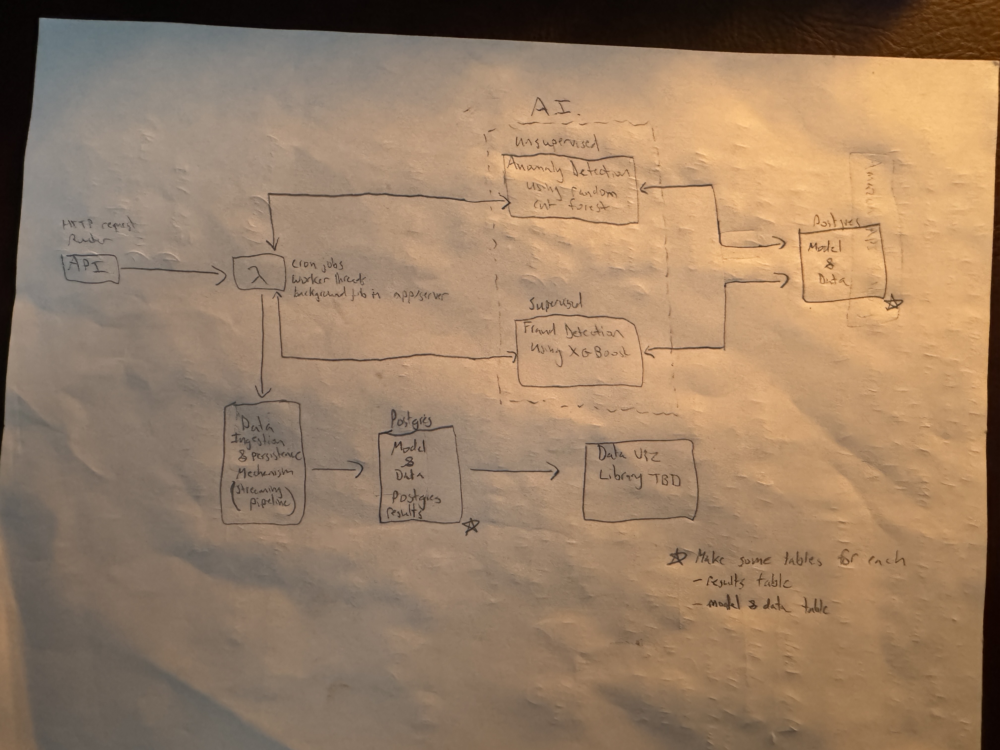

# Getting Started

## Docker Installation

- Follow the instructions here to install Docker [https://docs.docker.com/desktop/](https://docs.docker.com/desktop/)

- **Note for Windows Users:**
Windows, you're on your own here. It is recommended to use WSL2 (Windows Subsystem for Linux 2) to simplify the Docker installation and operation process. This approach is beneficial as it provides a Linux-like environment on Windows which is optimal for running Docker.

## Docker Compose Installation

[https://docs.docker.com/compose/install/](https://docs.docker.com/compose/install/)

## Quick Setup Alternative for Ubuntu 20.0.4 (It's the only one I've tested)

Do both the Docker and Docker Compose Installations.

### Docker Installation

```
sudo apt update
sudo apt install apt-transport-https ca-certificates curl software-properties-common
curl -fsSL https://download.docker.com/linux/ubuntu/gpg | sudo apt-key add -
sudo apt-key fingerprint 0EBFCD88
sudo add-apt-repository "deb [arch=amd64] https://download.docker.com/linux/ubuntu $(lsb_release -cs) stable"
sudo apt update
sudo apt install docker-ce docker-ce-cli containerd.io
sudo docker run hello-world # Checks that Docker is installed correctly
sudo systemctl enable docker
sudo systemctl status docker
```

### Docker Compose Installation

```
sudo curl -L "https://github.com/docker/compose/releases/download/1.29.2/docker-compose-$(uname -s)-$(uname -m)" -o /usr/local/bin/docker-compose
sudo chmod +x /usr/local/bin/docker-compose
docker-compose --version # verify installation and version
```

## Bulding & Running the Docker Container

`docker-compose up`

This command will start all services defined in your `docker-compose.yml` file. Ensure that this file is set up correctly to define and configure services such as your FastAPI application and JupyterLab.
This can take awhile to run.

# Accessing Services

- **FastAPI Service:** Available at `http://localhost:8000`. The interactive API documentation generated by Swagger UI can be be accessed at `http://localhost:8000/docs`
- **JupyterLab:** Can be accessed at `http://localhost:8888` (retrieve the token from Docker logs).


# Problem Statement (WIP)

Create a real-time system that provides notifications for anomalies detected for credit card fraud using machine learning models. The system needs to be highly decoupled and it will contain both supervised and unsupervised learning aspects.

# About the Data Set

The dataset was taken from [Kaggle](https://www.kaggle.com/datasets/mlg-ulb/creditcardfraud?resource=download).

note: The context and content sections were taken directly from there.

## Context

It is important that credit card companies are able to recognize fraudulent credit card transactions so that customers are not charged for items that they did not purchase.


## Content

The dataset contains transactions made by credit cards in September 2013 by European cardholders.
This dataset presents transactions that occurred in two days, where we have 492 frauds out of 284,807 transactions. The dataset is highly unbalanced, the positive class (frauds) account for 0.172% of all transactions.

It contains only numerical input variables which are the result of a PCA transformation. Unfortunately, due to confidentiality issues, we cannot provide the original features and more background information about the data. Features V1, V2, … V28 are the principal components obtained with PCA, the only features which have not been transformed with PCA are 'Time' and 'Amount'. Feature 'Time' contains the seconds elapsed between each transaction and the first transaction in the dataset. The feature 'Amount' is the transaction Amount, this feature can be used for example-dependant cost-sensitive learning. Feature 'Class' is the response variable and it takes value 1 in case of fraud and 0 otherwise.

Given the class imbalance ratio, we recommend measuring the accuracy using the Area Under the Precision-Recall Curve (AUPRC). Confusion matrix accuracy is not meaningful for unbalanced classification.


### Key Points

Some key points to take from the content description are that:

1. **There is a class imbalance:** Fraudulent transactions are only $0.172$% of the dataset, so standard accuracy metrics (like confusion matrix accuracy) aren't useful. This is why we should strongly consider using the area under the precision recall curve (**AUPRC**) --it will focus on how well the model identifies fraud (positive class)
2. **PCA-Transformed Features (V1-V28):** These are numerical features, but since they've been transformed via PCA, we might not have direct interpretability regarding the original features. This should not affect the model's ability to learn from the data, but it may influence interpretability later on.
3. **Time & Amount:** These are two components that are non-PCA-transformed. They can play a critical role in cost-sensitive learning, where the amount of each transaction might influence the model's cost decisions.

### Handling Class Imbalance

This can be handled with different smapling techniques such as

1. **SMOTE (Synthetic Minority Over-Sampling Technique):** This creates synthetic examples of the minority class (fraud) to balance the dataset.
2. **Undersampling:** Reduce the number of non-fraud transactions to balance the classes.

### Initial Approach

We'll treat this as a hybrid problem in which anomaly detection is treated in an unsupervised learning manner and fraud detection is treated as a supervised learning problem.

### Unsupervised Learning Methods to Explore (Anomaly Detection)

We'll try: `Random Cut Forest`, `One-Class SVM`, and `autoencoders`.

More on why we'd opt for a `Random Cut Forest` as opposed to an `Isolation Forest`:

**Isolation Forest:** 
  
  - **How They work:** They work by building random binary decision trees, where each splot isolates data points by choosing a feature and a random threshold. Anomalies are isolated quickly since they tend to have distinct values compare to normal data points.
  
  - **Where They Excel:** These typically work well with tabluar data or data than can be described by a feature vector. While these are easy to understand and implement, they only tend to work best in traditional anomaly detection problems where the dataset has structured and static features. As we all know, this is essentially a game of cat and mouse where as more fraudsters get caught, they get wiser and develop different techniques by learning from the mistakes of others that came before them.

**Random Cut Forest:** 

  - **How They Work:** Instead of binary trees, RCF uses random hyperplane cuts to partition data. It then builds a forest of trees, where each tree represents a set of cuts. Anomalies are then characterizes as those that are easily isolated by fewer cuts. Since these cuts aren't constrained by a specific devision tree structure, they can capture more complex data distributions.
   
  - **Where they Excel:** These are more versatile and are better suited for high-dimensional data and time series data, especially real-time environments. They can be used where data distributions are complex and change over time. Its essentially better at detecting anomalies in evolving datasets, which is exactly what we have in this back and forth competition between evasion and detection.

I can't stress enough the importance of opting for the `Random Cut Forest` approach. This type of model is critical in systems where we're required to continuously detect anomalies in real-time. Ultimately, this will come down to the data characteristics such as dimensionality and tabularity. This will be explored more in-depth in an EDA notebook.
  
### Supervised Learning Methods to Explore (Fraud Detection)

We'll try: `XGBoost`, `Logistic Regression`, and `Random Forest`


# System Outline

May chang in the future, but this is it for now. Need to replace hand drawing with something created with a diagraming tool


